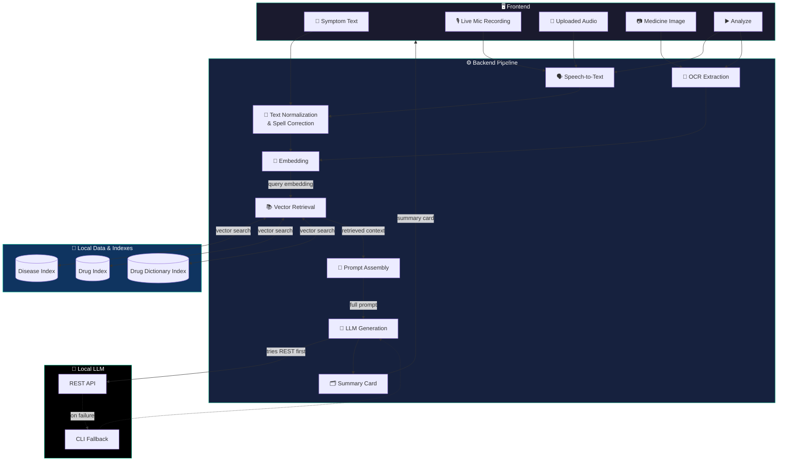
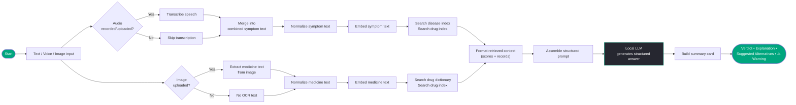
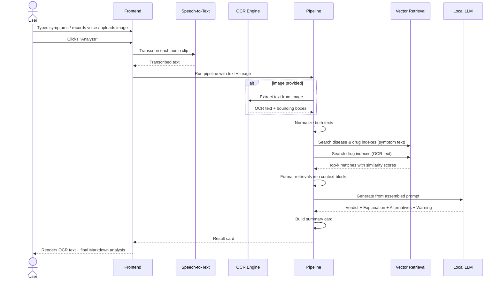
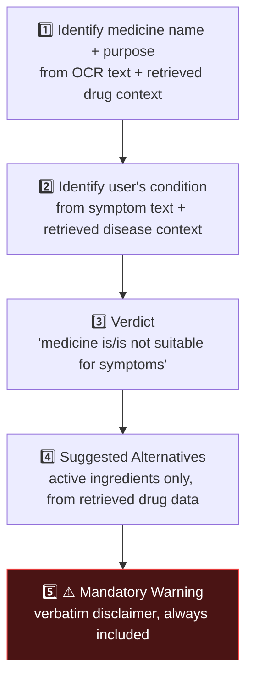

<div align="center">

# 🏥 MediScanAI

### Privacy-First, Multimodal AI Health Copilot

*Symptoms in text, voice, or a photo of a medicine strip — one local RAG pipeline turns them into a grounded, doctor-style verdict.*

[](https://www.python.org/)
[](https://streamlit.io/)
[](https://github.com/facebookresearch/faiss)
[-000000)](https://ollama.com/)
[](https://github.com/PaddlePaddle/PaddleOCR)
[]()

</div>

---

## 📖 Table of Contents

- [What is MediScanAI?](#-what-is-mediscanai)
- [Why it's different](#-why-its-different)
- [System architecture](#️-system-architecture)
- [End-to-end pipeline](#-end-to-end-pipeline)
- [Sequence diagram](#-sequence-diagram-a-single-analyze-click)
- [Repository layout](#-repository-layout)
- [Tech stack](#-tech-stack)
- [Module reference](#-module-reference)
- [Prompt contract](#-the-prompt-contract)
- [Getting started](#-getting-started)
- [Running tests](#-running-tests)
- [Data & index format](#-data--index-format)
- [Roadmap](#-roadmap)
- [Disclaimer](#️-disclaimer)
- [Author](#-author)

---

## 🩺 What is MediScanAI?

**MediScanAI** is a local-first healthcare assistant that answers one practical question:

> *"Is the medicine I'm holding actually right for what I'm feeling?"*

You can describe your symptoms by **typing**, **speaking**, or **uploading a picture of the medicine strip** — MediScanAI reads the label with OCR, transcribes your voice with Whisper, retrieves the most relevant disease and drug records from a local vector database, and asks a **locally-hosted LLM (Ollama)** to reason over that retrieved context and produce a structured verdict, an explanation, alternative suggestions, and a mandatory safety warning.

Nothing leaves your machine. No OpenAI/cloud calls, no telemetry — OCR, speech-to-text, embeddings, vector search, and generation all run on local models.

## ✨ Why it's different

| | |
|---|---|
| 🧩 **Multimodal by design** | Free text, live mic recording, uploaded audio, and medicine-photo OCR are all fused into one query |
| 🔒 **Fully local** | PaddleOCR, Faster-Whisper, SentenceTransformers, FAISS, and Ollama — zero cloud dependency |
| 🧠 **Grounded, not hallucinated** | The LLM is only allowed to reason over what FAISS actually retrieved — a strict prompt contract enforces structure |
| ⚠️ **Safety-first output** | Every response is forced through Verdict → Explanation → Alternatives → Warning, with a verbatim medical disclaimer |

---

## 🏗️ System Architecture



---

## 🔄 End-to-End Pipeline



---

## 🔁 Sequence Diagram — a single "Analyze" click



---

## 📂 Repository Layout

```text
MediScanAI/
│
├── frontend/
│   ├── app.py              # earlier prototype UI
│   └── app_new.py          # ✅ active UI — text + live/upload voice + image, Streamlit
│
├── backend/
│   ├── core_new.py         # ✅ active Pipeline: orchestrates OCR → retrieval → LLM → card
│   ├── core.py              # earlier pipeline version
│   ├── ocr.py               # PaddleOCR wrapper (extract + annotate)
│   ├── whisper.py           # Faster-Whisper speech-to-text wrapper
│   ├── embeddings.py        # SentenceTransformers (all-MiniLM-L6-v2) embedder
│   ├── retriever.py         # FAISS index wrapper + MultiRetriever
│   ├── prompt.py            # ANALYSIS_PROMPT_TEMPLATE — the strict output contract
│   ├── llm.py                # Ollama REST client with CLI fallback
│   ├── formatter_new.py     # builds the structured summary "card"
│   ├── formatter.py         # earlier formatter version
│   └── utils.py             # text normalization + SymSpell spell-correction, JSONL loader
│
├── data/                    # diseases_faiss_data.jsonl, drugs_faiss_data.jsonl, drug_dict_faiss_data.jsonl
├── indexes/                 # diseases_faiss.index, drugs_faiss.index, drug_dict_faiss.index
├── tests/                   # unit tests for every backend module
├── requirements.txt
└── README.md
```

> 💡 `_new` suffixed files (`app_new.py`, `core_new.py`, `formatter_new.py`) are the **current, active** implementations. Their non-suffixed counterparts are earlier iterations kept for reference — the codebase shows clear signs of active in-place experimentation (see the commented-out earlier drafts at the top of several files).

---

## 🧩 Tech Stack

| Layer | Technology | Purpose |
|---|---|---|
| 🖼️ Frontend | **Streamlit** + `streamlit_mic_recorder` | Sidebar inputs, live mic capture, results rendering |
| 🔤 OCR | **PaddleOCR** (`use_textline_orientation=True`) | Reads medicine strip images, returns text + polygons |
| 🗣️ Speech-to-Text | **Faster-Whisper** (`base`, CPU, int8) | Transcribes recorded/uploaded audio |
| ✍️ Text Cleanup | **SymSpell** | Spell-correction while preserving numeric dosages |
| 🧬 Embeddings | **SentenceTransformers** — `all-MiniLM-L6-v2` | Converts normalized text into dense vectors |
| 📚 Vector Search | **FAISS** | Nearest-neighbour lookup across 3 local indexes |
| 🤖 LLM | **Ollama** — `mistral` (REST API, CLI fallback) | Reasons over retrieved context, writes final verdict |
| 🖌️ Image Ops | **OpenCV** | Bounding-box annotation for OCR preview |

---

## 🔍 Module Reference

<details>
<summary><strong>backend/ocr.py</strong> — Medicine label reading</summary>

- `extract_text_from_image(path)` → runs PaddleOCR, returns `{texts, boxes, preview_image}`
- `extract_with_preview(path)` → same, plus an annotated OpenCV image with boxes + labels drawn (for UI debugging)
- `ocr_text_join(texts)` → joins recognized lines into one clean string for embedding
</details>

<details>
<summary><strong>backend/whisper.py</strong> — Speech-to-text</summary>

- `WhisperTranscriber(model_size="base")` loads a CPU/int8 Faster-Whisper model once
- `transcribe_audio_file(path)` → transcribes and concatenates all detected segments
</details>

<details>
<summary><strong>backend/embeddings.py</strong> — Vectorization</summary>

- Lazily loads a singleton `SentenceTransformer("all-MiniLM-L6-v2")`
- `embed_texts(texts)` → batched numpy embeddings for any iterable of strings
</details>

<details>
<summary><strong>backend/retriever.py</strong> — Vector search</summary>

- `FaissIndexWrapper` — loads one FAISS index + its JSONL record map, exposes `.search(embedding, top_k)`
- `MultiRetriever` — holds three wrappers (`diseases`, `drugs`, `drug_dict`) and exposes `search_specific(index_name, text, top_k)`, which normalizes → embeds → searches a single named index
</details>

<details>
<summary><strong>backend/utils.py</strong> — Normalization</summary>

- `normalize_text(s)` — lowercases, protects numeric dosage values behind placeholders, strips punctuation, and runs each word through a **SymSpell** dictionary lookup (edit distance ≤ 2) before restoring the numbers
- `load_jsonl_to_dict(path, id_key)` — loads a JSONL data file into an `id → record` map used alongside each FAISS index
</details>

<details>
<summary><strong>backend/llm.py</strong> — Local generation</summary>

- `call_ollama_api_generate()` — POSTs to `http://localhost:11434/api/generate`
- `call_ollama_cli_generate()` — fallback: shells out to the `ollama run <model>` CLI if the REST call fails
- `generate(prompt, model="mistral")` — high-level entry point used by the pipeline
</details>

<details>
<summary><strong>backend/core_new.py</strong> — Orchestration</summary>

The active `Pipeline` class:
1. Normalizes the user's symptom text
2. If an image was provided, runs OCR and joins the extracted text
3. Runs `search_specific` against `diseases` + `drugs` for the symptom text, and against `drug_dict` + `drugs` for the OCR text
4. Formats all four retrieval sets into a readable context block
5. Fills `ANALYSIS_PROMPT_TEMPLATE` and calls `generate()`
6. Wraps everything into a summary card via `build_summary_card()`
</details>

<details>
<summary><strong>backend/formatter_new.py</strong> — Presentation</summary>

- `build_summary_card()` — packages `user_text`, `ocr_text`, `llm_output`, and a trimmed preview of every retrieved record (disease name, symptoms, brand/generic name, indications) into one dict
- `pretty_print_card()` — CLI/debug-friendly string rendering of the same card
</details>

---

## 📝 The Prompt Contract

`backend/prompt.py` enforces a **strict, non-negotiable output structure** so the LLM can't ramble or skip the safety warning:



The model is explicitly told to use **only** the retrieved context — no free-floating medical claims — and to close with a fixed, verbatim safety disclaimer every time.

---

## 🚀 Getting Started

### 1. Clone the repository

**macOS / Linux**
```bash
git clone https://github.com/yourusername/MediScanAI.git
cd MediScanAI
```

**Windows (PowerShell)**
```powershell
git clone https://github.com/yourusername/MediScanAI.git
cd MediScanAI
```

### 2. Create a virtual environment (recommended)

**macOS / Linux**
```bash
python3 -m venv venv
source venv/bin/activate
```

**Windows (PowerShell)**
```powershell
python -m venv venv
venv\Scripts\Activate.ps1
```

### 3. Install dependencies

**macOS / Linux / Windows**
```bash
pip install -r requirements.txt
```

> ⚠️ `utils.py` requires a SymSpell frequency dictionary file (`frequency_dictionary_en_82_765.txt`) placed inside `backend/`.

### 4. Install & prepare Ollama

**macOS / Linux**
```bash
# Install Ollama: https://ollama.com/download
ollama pull mistral
```

**Windows (PowerShell)**
```powershell
# Install Ollama: https://ollama.com/download
ollama pull mistral
```

### 5. Build / place your FAISS indexes

The retriever expects these files to already exist:

```text
indexes/diseases_faiss.index      data/diseases_faiss_data.jsonl
indexes/drugs_faiss.index         data/drugs_faiss_data.jsonl
indexes/drug_dict_faiss.index     data/drug_dict_faiss_data.jsonl
```

### 6. Run the app

The quickest way — a single setup + launch script:

**macOS / Linux**
```bash
chmod +x start.sh
./start.sh
```

**Windows (PowerShell / Git Bash)**
```bash
bash start.sh
```

Or run Streamlit directly on any platform:

```bash
streamlit run frontend/app_new.py
```

Open the local URL Streamlit prints, describe your symptoms (type or speak), optionally upload a photo of the medicine strip, and hit **Analyze**.

---

## 🧪 Running Tests

```bash
python tests/test_utils.py
python tests/test_ocr.py
python tests/test_whisper.py
python tests/test_embeddings.py
python tests/test_retriever.py
python tests/test_llm.py
python tests/test_pipeline.py
python tests/test_pipeline_new.py
```

---

## 🗄️ Data & Index Format

Each of the three domains (`diseases`, `drugs`, `drug_dict`) is a matched pair:

| File | Role |
|---|---|
| `indexes/<name>_faiss.index` | FAISS index of MiniLM embeddings for that domain |
| `data/<name>_faiss_data.jsonl` | One JSON record per line, keyed by `id`, aligned positionally with the FAISS vectors |

`FaissIndexWrapper` loads both, and a search returns `(record_key, similarity_score, full_record_dict)` triples — which `formatter_new.py` trims down to the handful of preview fields (`disease`, `symptoms`, `brand_name`, `generic_name`, `drug_name`, `indications_and_usage`) shown to the LLM and the user.

---

## 🎯 Roadmap

- [ ] 📱 Mobile app integration
- [ ] 💊 Drug–drug interaction checker
- [ ] 🧾 Full prescription scanner (multi-drug labels)
- [ ] 🗂️ Patient history tracking
- [ ] 🚨 Emergency warning system for critical symptom combinations
- [ ] 🌍 Multilingual support (OCR + Whisper + prompt)
- [ ] 🎓 Fine-tuned medical LLM in place of general-purpose Mistral

---

## ⚠️ Disclaimer

MediScanAI **does not replace professional medical advice, diagnosis, or treatment**. It is built for **educational and informational purposes only**. Every generated response is required to end with a mandatory safety warning directing users to a qualified doctor or pharmacist — always follow it.

---

## 👨‍💻 Author

**Sreevedh Jella**
AI · Healthcare · Privacy-First Systems

<div align="center">

*Built with 🧠 local LLMs, 🔍 FAISS, and a healthy respect for keeping medical data off the cloud.*

</div>