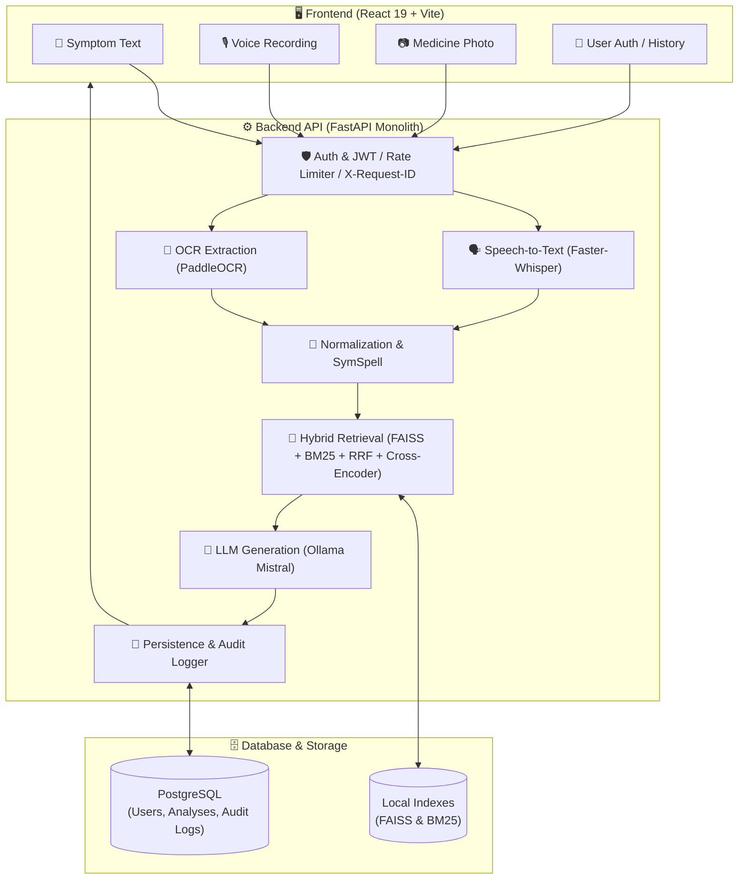

<div align="center">

# 🏥 MediScanAI

### Privacy-First, Multimodal AI Health Copilot

*Symptoms in text, voice, or a photo of a medicine strip — one local, hybrid-retrieval RAG pipeline turns them into a grounded, doctor-style clinical verdict.*

[](https://www.python.org/)
[](https://fastapi.tiangolo.com/)
[](https://www.postgresql.org/)
[](https://react.dev/)
[](https://github.com/facebookresearch/faiss)
[]()
[]()
[-9cf)](https://www.sbert.net/docs/pretrained-models/ce-msmarco.html)
[-000000)](https://ollama.com/)
[](https://www.docker.com/)
[]()

</div>

---

## 📖 Table of Contents

- [What is MediScanAI?](#-what-is-mediscanai)
- [System Architecture](#️-system-architecture)
- [Key Features & Capabilities](#-key-features--capabilities)
- [Tech Stack](#-tech-stack)
- [Repository Layout](#-repository-layout)
- [Environment Variables](#-environment-variables)
- [Getting Started & Local Setup](#-getting-started--local-setup)
- [Database Setup & Alembic Migrations](#-database-setup--alembic-migrations)
- [Local AI / Ollama Setup](#-local-ai--ollama-setup)
- [Running Backend & Frontend](#-running-backend--frontend)
- [Docker Deployment](#-docker-deployment)
- [Testing & Quality Assurance](#-testing--quality-assurance)
- [Security & Privacy Architecture](#-security--privacy-architecture)
- [Disclaimer](#️-disclaimer)
- [Author](#-author)

---

## 🩺 What is MediScanAI?

**MediScanAI** is a privacy-conscious, local-first healthcare copilot designed to answer one practical question:

> *"Is the medicine I'm holding actually right for what I'm feeling?"*

Users describe their symptoms by **typing text**, **recording voice notes**, or **uploading a photo of a medicine strip**. MediScanAI coordinates local computer vision (PaddleOCR), speech recognition (Faster-Whisper), a **4-stage hybrid retrieval pipeline** (Dense FAISS + Sparse BM25 + Reciprocal Rank Fusion + Cross-Encoder Reranker), and a **locally-hosted LLM (Ollama / Mistral)** to produce structured, safety-first clinical verdicts.

All medical data processing occurs locally without third-party cloud inference or external telemetry.

---

## 🏗️ System Architecture



---

## ✨ Key Features & Capabilities

* **Multimodal Inputs:** Process text symptoms, audio recordings (WAV/MP3), and medicine strip photos (JPEG/PNG/WebP) in unified requests.
* **4-Stage Hybrid RAG:** Combines semantic embedding search (FAISS) with lexical keyword matching (BM25), reciprocal rank fusion (RRF `k=60`), and cross-encoder neural reranking (`ms-marco-MiniLM-L-6-v2`).
* **Database-Backed Authentication:** User registration, bcrypt password hashing, and JWT authorization (`HS256`).
* **Ownership & History Drawer:** Paginated analysis history, detail views, and user-isolated deletion.
* **Resource & Concurrency Protection:** Thread-safe sliding-window rate limiters and ML slot concurrency controllers preventing event loop blocking.
* **Lightweight Correlation:** `X-Request-ID` header propagation and unique sanitized `error_id` mapping for error tracking.
* **Privacy-First Audit Logging:** Audit logging of security and operational events with data minimization.

---

## 🧩 Tech Stack

| Component | Technology | Purpose |
|---|---|---|
| **Frontend** | React 19, Vite, Tailwind CSS | Responsive user interface, dark mode, audio recorder, history drawer |
| **Backend Framework** | FastAPI, Uvicorn, Starlette | High-performance asynchronous REST API |
| **Relational Database** | PostgreSQL 15+, SQLAlchemy 2.0 | Persistent user accounts, analysis records, and audit logs |
| **Database Migrations** | Alembic | Version-controlled schema evolutions |
| **OCR Vision** | PaddleOCR | Text extraction and bounding box detection from medicine strips |
| **Speech Recognition** | Faster-Whisper (CPU / int8) | Local voice note transcription |
| **Vector Search** | FAISS + SentenceTransformers (`all-MiniLM-L6-v2`) | Dense semantic similarity matching across medical corpora |
| **Sparse Search** | In-Memory Okapi BM25 | Exact keyword recovery for drug names, dosages, and typos |
| **Reranking** | Cross-Encoder (`ms-marco-MiniLM-L-6-v2`) | Joint query-document relevance scoring and reranking |
| **Local LLM** | Ollama (`mistral`) | Structured clinical verdict generation with safety warnings |
| **Containerization** | Docker, Docker Compose | Reproducible local deployment environment |

---

## 📂 Repository Layout

```text
mediscanai/
├── backend/                 # FastAPI backend application
│   ├── api/                 # API route handlers (auth, analyses, deps)
│   ├── core/                # Config, security, rate limiter, middleware, concurrency, audit
│   ├── db/                  # SQLAlchemy base and session management
│   ├── models/              # ORM models (User, Analysis, AuditLog)
│   ├── schemas/             # Pydantic request/response schemas
│   └── main.py              # Application entry point & /api/analyze router
├── frontend/                # React 19 + Vite frontend application
│   ├── src/
│   │   ├── components/      # UI components (LandingAuth, Dashboard)
│   │   ├── config/          # Centralized API endpoints (api.js)
│   │   └── utils/           # Authentication token storage helper
│   ├── index.html
│   └── package.json
├── app/                     # Core multimodal AI / RAG pipeline
│   ├── core.py              # Main clinical pipeline orchestrator
│   ├── embeddings.py        # SentenceTransformers dense embeddings
│   ├── retriever.py         # FAISS + BM25 + RRF + Cross-Encoder reranker
│   ├── ocr.py               # PaddleOCR wrapper
│   ├── whisper.py           # Faster-Whisper speech-to-text wrapper
│   ├── llm.py               # Ollama client with timeout & error handling
│   ├── prompt.py            # Defensive prompt templates and output contract
│   └── formatter.py         # Structured summary card formatters
├── alembic/                 # Alembic migration scripts (0001 to 0003)
├── data/                    # JSONL medical corpora (diseases, drugs, dictionary)
├── indexes/                 # Pre-built FAISS vector indexes
├── tests/                   # Automated pytest suite (unit, api, database, e2e smoke)
│   ├── unit/                # Fast isolated component unit tests
│   ├── api/                 # Endpoint and authorization tests
│   ├── database/            # PostgreSQL & SQLite database layer tests
│   └── test_e2e_smoke.py    # Complete lifecycle end-to-end smoke test
├── Dockerfile               # Backend container definition
├── docker-compose.yml       # Minimal Compose definition for Postgres + Backend
├── .dockerignore
├── .env.example             # Environment configuration template
├── requirements.txt         # Python dependencies
├── run_tests.sh             # Unified test suite runner
└── README.md
```

---

## ⚙️ Environment Variables

Copy `.env.example` to `.env` and configure your local settings:

```bash
cp .env.example .env
```

| Variable | Default | Description |
|---|---|---|
| `APP_ENV` | `development` | Application environment (`development` or `production`). In production, wildcard CORS is rejected. |
| `DATABASE_URL` | `postgresql+psycopg2://localhost:5432/mediscanai` | PostgreSQL connection URI. |
| `JWT_SECRET_KEY` | *(Required)* | Secret key used for signing JWT authentication tokens. |
| `JWT_ALGORITHM` | `HS256` | JWT cryptographic signing algorithm. |
| `ACCESS_TOKEN_EXPIRE_MINUTES` | `60` | JWT token validity window in minutes. |
| `OLLAMA_BASE_URL` | `http://localhost:11434` | Ollama service endpoint. |
| `OLLAMA_MODEL` | `mistral` | LLM model tag for clinical reasoning. |
| `CORS_ORIGINS` | `http://localhost:5173,http://127.0.0.1:5173` | Allowed frontend origin list. |
| `MAX_CONCURRENT_ANALYSES` | `2` | Bounded capacity for simultaneous ML analyses. |
| `RATE_LIMIT_ANALYZE_PER_MINUTE` | `10` | Max `/api/analyze` submissions per IP/user per minute. |

---

## 🚀 Getting Started & Local Setup

### 1. Prerequisites
* **Python 3.10+** (Conda recommended)
* **Node.js 18+** & npm
* **PostgreSQL 15+**
* **Ollama** installed locally

### 2. Python Environment

```bash
# Using Conda (Recommended)
conda create -n med-env python=3.10 -y
conda activate med-env

# Install dependencies
pip install -r requirements.txt
```

---

## 🗄️ Database Setup & Alembic Migrations

Ensure PostgreSQL is running and create the application database:

```bash
# Create database
createdb mediscanai

# Apply all Alembic migrations up to head
alembic upgrade head
```

---

## 🧠 Local AI / Ollama Setup

Install Ollama from [ollama.com](https://ollama.com) and pull the reasoning model:

```bash
ollama pull mistral
```

Verify Ollama is reachable at `http://localhost:11434`.

---

## 🏃 Running Backend & Frontend

### Automated Startup Script
```bash
chmod +x start.sh
./start.sh
```

### Or Run Manually in Separate Terminals:

**Terminal 1 — Backend API:**
```bash
conda activate med-env
uvicorn backend.main:app --host 127.0.0.1 --port 8000 --reload
```

**Terminal 2 — React Frontend:**
```bash
cd frontend
npm install
npm run dev
```

Open `http://localhost:5173` in your browser.

---

## 🐳 Docker Deployment

A minimal Docker Compose configuration is provided for reproducing the PostgreSQL database and FastAPI backend:

```bash
# Start PostgreSQL and Backend containers
docker compose up --build -d

# Verify container health
docker compose ps

# Check backend health
curl http://localhost:8000/api/health
```

*Note: The backend container communicates with your host's Ollama instance via `http://host.docker.internal:11434`.*

---

## 🧪 Testing & Quality Assurance

Run the unified test runner:

```bash
# Run fast deterministic test suite (Unit, API, Database, E2E Smoke)
./run_tests.sh

# Run all test suites including real AI model integration
./run_tests.sh --all
```

Or execute specific test modules directly:

```bash
pytest tests/unit -v
pytest tests/api -v
pytest tests/database -v
pytest tests/test_e2e_smoke.py -v
```

---

## 🛡️ Security & Privacy Architecture

* **Authentication & RBAC:** Secure password hashing with `bcrypt` (12 rounds) and short-lived stateless JWT access tokens.
* **Input Sanitization & Bounds Checking:** File upload limits (10MB image, 25MB audio, 4,000 char symptom text) with binary magic byte validation.
* **Prompt Injection Defense:** Strict input encapsulation preventing user-provided text or OCR labels from breaking out of LLM prompt templates.
* **CORS Safety:** Production configurations enforce explicit allowed origins and strictly disallow wildcard (`*`) access.
* **Observability without Trace Leakage:** Opaque correlation via `X-Request-ID` and masked server-side `error_id` tags prevent internal stack traces from leaking to clients.
* **Non-Blocking Architecture:** Heavy compute tasks (Whisper transcription, FAISS search, LLM generation) execute via `asyncio.to_thread` worker threads with bounded semaphore controls.

---

## ⚠️ Disclaimer

**MediScanAI is built for educational, research, and informational purposes only.** It does not provide medical diagnosis, prescription validation, or treatment recommendations. Always consult a qualified medical professional or healthcare provider regarding health conditions or medications.

---

## 👨‍💻 Author

**Sreevedh Jella**  
AI · Healthcare · Privacy-First Systems
