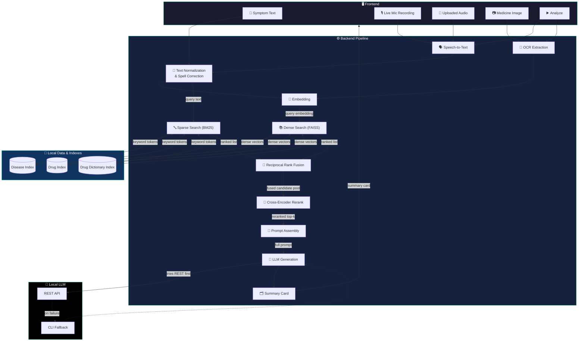
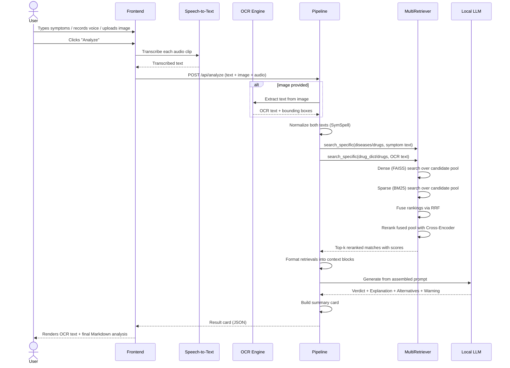
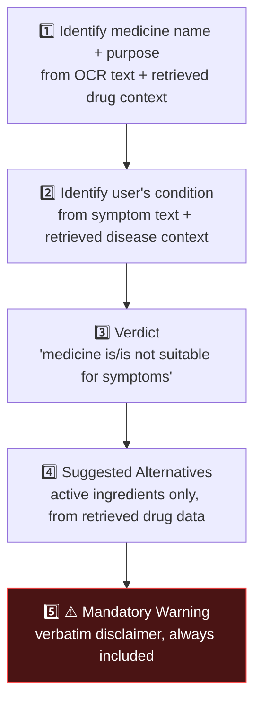

<div align="center">

# 🏥 MediScanAI

### Privacy-First, Multimodal AI Health Copilot

*Symptoms in text, voice, or a photo of a medicine strip — one local, hybrid-retrieval RAG pipeline turns them into a grounded, doctor-style verdict.*

[](https://www.python.org/)
[](https://react.dev/)
[](https://github.com/facebookresearch/faiss)
[]()
[]()
[-9cf)](https://www.sbert.net/docs/pretrained-models/ce-msmarco.html)
[-000000)](https://ollama.com/)
[](https://github.com/PaddlePaddle/PaddleOCR)
[]()

</div>

---

## 📖 Table of Contents

- [What is MediScanAI?](#-what-is-mediscanai)
- [Why it's different](#-why-its-different)
- [🆕 What's new — Hybrid Retrieval Upgrade](#-whats-new--hybrid-retrieval-upgrade)
- [System architecture](#️-system-architecture)
- [End-to-end pipeline](#-end-to-end-pipeline)
- [Sequence diagram](#-sequence-diagram-a-single-analyze-click)
- [Repository layout](#-repository-layout)
- [Tech stack](#-tech-stack)
- [Module reference](#-module-reference)
- [Prompt contract](#-the-prompt-contract)
- [Getting started](#-getting-started)
- [Running tests](#-running-tests)
- [Data & index format](#-data--index-format)
- [Roadmap](#-roadmap)
- [Disclaimer](#️-disclaimer)
- [Author](#-author)

---

## 🩺 What is MediScanAI?

**MediScanAI** is a local-first healthcare assistant that answers one practical question:

> *"Is the medicine I'm holding actually right for what I'm feeling?"*

You can describe your symptoms by **typing**, **speaking**, or **uploading a picture of the medicine strip** — MediScanAI reads the label with OCR, transcribes your voice with Whisper, retrieves the most relevant disease and drug records using a **hybrid dense + sparse retrieval pipeline**, and asks a **locally-hosted LLM (Ollama)** to reason over that retrieved context and produce a structured verdict, an explanation, alternative suggestions, and a mandatory safety warning.

Nothing leaves your machine. No OpenAI/cloud calls, no telemetry — OCR, speech-to-text, embeddings, vector search, sparse search, reranking, and generation all run on local models.

## ✨ Why it's different

| | |
|---|---|
| 🧩 **Multimodal by design** | Free text, live mic recording, uploaded audio, and medicine-photo OCR are all fused into one query |
| 🔒 **Fully local** | PaddleOCR, Faster-Whisper, SentenceTransformers, FAISS, BM25, a Cross-Encoder reranker, and Ollama — zero cloud dependency |
| 🔀 **Hybrid retrieval, not just vector search** | Every query runs through dense (FAISS) **and** sparse (BM25) search, fused with **Reciprocal Rank Fusion**, then reordered by a **Cross-Encoder reranker** for precision |
| 🧠 **Grounded, not hallucinated** | The LLM is only allowed to reason over what retrieval actually surfaced — a strict prompt contract enforces structure |
| ⚠️ **Safety-first output** | Every response is forced through Verdict → Explanation → Alternatives → Warning, with a verbatim medical disclaimer |

---

## 🆕 What's New — Hybrid Retrieval Upgrade

The retrieval layer (`app/retriever.py`) was rebuilt from a plain FAISS nearest-neighbour lookup into a **4-stage hybrid search + rerank pipeline**, and the rest of the codebase (`app/core.py`, `backend/main.py`, `tests/`) was updated to match:

| Area | Change |
|---|---|
| **Sparse retrieval (BM25)** | Added a pure-Python, dependency-free `BM25Index` (Okapi BM25, `k1=1.5`, `b=0.75`) built in-memory per index (`diseases`, `drugs`, `drug_dict`) from the same JSONL records used by FAISS |
| **Rank fusion (RRF)** | Added `rrf_fuse()` — merges the FAISS candidate ranking and the BM25 candidate ranking using **Reciprocal Rank Fusion** (`k=60`) so neither signal dominates purely on raw score scale |
| **Cross-Encoder reranking** | Added `CrossEncoderReranker`, wrapping `sentence-transformers` `cross-encoder/ms-marco-MiniLM-L-6-v2`. It scores `(query, candidate_text)` pairs directly and re-sorts the fused candidate pool for the final `top_k` |
| **`MultiRetriever.search_specific()`** | Now runs a 4-step flow per query per index: **(1)** dense FAISS search over a wider candidate pool (`max(15, top_k*3)`) → **(2)** BM25 sparse search over the same pool size → **(3)** RRF-fuse both rankings → **(4)** Cross-Encoder rerank the fused pool down to `top_k` |
| **`extract_text_for_bm25()`** | New per-index text extractors so BM25 and the reranker can read a flattened searchable string out of each record type (disease name + symptoms, brand/generic/substance names + usage, or drug name) |
| **Startup cost** | `MultiRetriever.__init__` now also builds the in-memory BM25 indexes and eagerly warms up (loads) the Cross-Encoder model once, so first-query latency stays low |
| **`app/core.py` (`Pipeline`)** | Consolidated into a single active pipeline (previous `core_new.py` / `formatter_new.py` split has been merged); verbose console logging now reports fused & reranked ranks with Cross-Encoder scores for every retrieval call |
| **`app/formatter.py`** | Single active formatter (`build_summary_card`, `pretty_print_card`) — previews are built from the reranked, hybrid top-`k` results |
| **Frontend** | Migrated to a **Vite + React 19 + Tailwind CSS v4** SPA (`frontend/`) with a landing/auth screen (`LandingAuth.jsx`) and a workspace dashboard (`Dashboard.jsx`) for text, voice, and image input, replacing the earlier single-page UI |
| **Backend API** | `backend/main.py` (FastAPI) exposes `POST /api/analyze` accepting symptom text, audio clip(s), and a medicine image in one multipart request, and pre-warms both the retrieval pipeline and the Whisper transcriber on startup |
| **Tests** | All test modules (`tests/test_retriever.py`, `tests/test_pipeline.py`, etc.) now import from `app.*` and exercise the hybrid search path end-to-end |

**Why hybrid retrieval?** Dense embeddings (FAISS) are great at capturing semantic/paraphrased meaning but can miss exact keyword matches — which matter a lot for drug names, dosages, and OCR'd label text full of typos. BM25 recovers those exact/near-exact lexical matches. RRF combines both rankings without needing to normalize incompatible score scales, and the Cross-Encoder reranker — which looks at the full query and candidate together rather than comparing independent embeddings — gives a final precision pass that pushes the truly best-matching records to the top.

---

## 🏗️ System Architecture



---

## 🔄 End-to-End Pipeline

```mermaid
flowchart LR
    S([Start]) --> I1["Text / Voice / Image input"]
    I1 --> D{"Image\nuploaded?"}
    D -- Yes --> OCR["Extract medicine text\nfrom image"]
    D -- No --> SKIP1["No OCR text"]
    I1 --> V{"Audio\nrecorded/uploaded?"}
    V -- Yes --> WSP["Transcribe speech"]
    V -- No --> SKIP2["Skip transcription"]
    WSP --> MERGE["Merge into\ncombined symptom text"]
    SKIP2 --> MERGE
    OCR --> NORM2["Normalize medicine text"]
    SKIP1 --> NORM2
    MERGE --> NORM1["Normalize symptom text"]
    NORM1 --> EMB1["Embed symptom text"]
    NORM2 --> EMB2["Embed medicine text"]
    EMB1 --> R1a["Dense search:\ndisease + drug index"]
    NORM1 --> R1b["BM25 search:\ndisease + drug index"]
    EMB2 --> R2a["Dense search:\ndrug dictionary + drug index"]
    NORM2 --> R2b["BM25 search:\ndrug dictionary + drug index"]
    R1a --> F1["RRF fuse"]
    R1b --> F1
    R2a --> F2["RRF fuse"]
    R2b --> F2
    F1 --> CE1["Cross-Encoder rerank"]
    F2 --> CE2["Cross-Encoder rerank"]
    CE1 --> CTX["Format retrieved context\n(scores + records)"]
    CE2 --> CTX
    CTX --> PROMPT["Assemble structured prompt"]
    PROMPT --> LLM["Local LLM\ngenerates structured answer"]
    LLM --> CARD["Build summary card"]
    CARD --> OUT(["Verdict • Explanation •\nSuggested Alternatives • ⚠️ Warning"])

    style S fill:#00A67E,color:#fff
    style OUT fill:#00A67E,color:#fff
    style LLM fill:#262730,stroke:#00C896,color:#fff
```



---

## 🔁 Sequence Diagram — a single "Analyze" click



---

## 📂 Repository Layout

```text
MediScanAI/
│
├── frontend/                # ✅ Vite + React 19 (Tailwind CSS v4) SPA
│   ├── src/
│   │   ├── components/
│   │   │   ├── LandingAuth.jsx # Pre-app Landing & simulated Sign In/Up
│   │   │   └── Dashboard.jsx   # Core Workspace UI: Text, Voice, Dropzone Image
│   │   ├── App.jsx         # App view & Theme (Light/Dark) coordinator
│   │   ├── main.jsx        # React entry point
│   │   ├── App.css / index.css # Tailwind imports & customized styling variables
│   ├── index.html          # Web entry point with FOUC theme injection
│   ├── vite.config.js
│   └── package.json
│
├── app/                    # ✅ RAG Core Pipeline
│   ├── core.py              # Active Pipeline: orchestrates OCR → hybrid retrieval → LLM → card
│   ├── ocr.py                # PaddleOCR wrapper (extract + annotate)
│   ├── whisper.py            # Faster-Whisper speech-to-text wrapper
│   ├── embeddings.py         # SentenceTransformers (all-MiniLM-L6-v2) embedder
│   ├── retriever.py          # BM25Index, rrf_fuse, CrossEncoderReranker, FaissIndexWrapper, MultiRetriever
│   ├── prompt.py              # ANALYSIS_PROMPT_TEMPLATE — the strict output contract
│   ├── llm.py                  # Ollama REST client with CLI fallback
│   ├── formatter.py            # Builds the structured summary "card"
│   └── utils.py                # Text normalization + SymSpell spell-correction, JSONL loader
│
├── backend/                # ✅ FastAPI Web Server
│   └── main.py              # FastAPI POST /api/analyze endpoint coordinator (text + audio[] + image)
│
├── data/                   # diseases_faiss_data.jsonl, drugs_faiss_data.jsonl, drug_dict_faiss_data.jsonl
├── indexes/                # diseases_faiss.index, drugs_faiss.index, drug_dict_faiss.index
├── tests/                  # Unit tests for every pipeline module (import from app.*)
├── requirements.txt
└── README.md
```

---

## 🧩 Tech Stack

| Layer | Technology | Purpose |
|---|---|---|
| 🖼️ Frontend | **React 19 (Vite + Tailwind CSS v4)** | Landing/auth screen, dashboard, voice recorder, dropzone file upload, dark mode toggler |
| 🔤 OCR | **PaddleOCR** (`use_textline_orientation=True`) | Reads medicine strip images, returns text + polygons |
| 🗣️ Speech-to-Text | **Faster-Whisper** (`base`, CPU, int8) | Transcribes recorded/uploaded audio |
| ✍️ Text Cleanup | **SymSpell** | Spell-correction while preserving numeric dosages |
| 🧬 Embeddings | **SentenceTransformers** — `all-MiniLM-L6-v2` | Converts normalized text into dense vectors |
| 📚 Dense Retrieval | **FAISS** | Nearest-neighbour lookup across 3 local indexes |
| 🔤 Sparse Retrieval | **BM25** (pure-Python `BM25Index`, Okapi BM25) | In-memory keyword/lexical search per index, built from the same JSONL records |
| 🔀 Rank Fusion | **Reciprocal Rank Fusion (RRF)** | Merges dense + sparse rankings into one candidate pool without score-scale mismatches |
| 🎯 Reranking | **Cross-Encoder** — `cross-encoder/ms-marco-MiniLM-L-6-v2` | Final precision pass: scores query–candidate pairs jointly, reorders the fused pool |
| 🤖 LLM | **Ollama** — `mistral` (REST API, CLI fallback) | Reasons over retrieved context, writes final verdict |
| 🌐 Backend API | **FastAPI + Uvicorn** | `POST /api/analyze` — accepts text, audio clip(s), and an image in one request |
| 🖌️ Image Ops | **OpenCV** | Bounding-box annotation for OCR preview |

---

## 🔍 Module Reference

<details>
<summary><strong>app/ocr.py</strong> — Medicine label reading</summary>

- `extract_text_from_image(path)` → runs PaddleOCR, returns `{texts, boxes, preview_image}`
- `extract_with_preview(path)` → same, plus an annotated OpenCV image with boxes + labels drawn (for UI debugging)
- `ocr_text_join(texts)` → joins recognized lines into one clean string for embedding
</details>

<details>
<summary><strong>app/whisper.py</strong> — Speech-to-text</summary>

- `WhisperTranscriber(model_size="base")` loads a CPU/int8 Faster-Whisper model once
- `transcribe_audio_file(path)` → transcribes and concatenates all detected segments
</details>

<details>
<summary><strong>app/embeddings.py</strong> — Vectorization</summary>

- Lazily loads a singleton `SentenceTransformer("all-MiniLM-L6-v2")`
- `embed_texts(texts)` → batched numpy embeddings for any iterable of strings
</details>

<details>
<summary><strong>app/retriever.py</strong> — Hybrid search (FAISS + BM25 + RRF + Cross-Encoder)</summary>

- `extract_text_for_bm25(index_name, record)` → flattens a record from any of the 3 index types into one searchable string (disease + symptoms / brand + generic + substance + usage / drug name)
- `BM25Index` — pure-Python Okapi BM25 (`k1=1.5`, `b=0.75`) built in-memory over a corpus; `.search(query, top_k)` returns `[(doc_idx, score), ...]` sorted by BM25 score
- `rrf_fuse(faiss_results, bm25_results, k=60)` → Reciprocal Rank Fusion of two ranked candidate lists into one combined `(key, rrf_score, obj)` ranking
- `CrossEncoderReranker` — lazily loads `cross-encoder/ms-marco-MiniLM-L-6-v2` on CPU; `.rerank(query, candidates, index_name, top_k)` scores every `(query, candidate_text)` pair and returns the top-`k` reordered by Cross-Encoder score
- `FaissIndexWrapper` — loads one FAISS index + its JSONL record map, exposes `.search(embedding, top_k)`
- `MultiRetriever` — holds three `FaissIndexWrapper`s + three `BM25Index`es (`diseases`, `drugs`, `drug_dict`) and one shared `CrossEncoderReranker`. `search_specific(index_name, text, top_k)`:
  1. Embeds + runs dense FAISS search over a wide candidate pool (`max(15, top_k*3)`)
  2. Runs BM25 sparse search over the same pool size
  3. Fuses both rankings with `rrf_fuse`
  4. Reranks the fused pool with the Cross-Encoder and returns the final `top_k`
  - `search_all(text, top_k)` runs `search_specific` across every configured index
</details>

<details>
<summary><strong>app/utils.py</strong> — Normalization</summary>

- `normalize_text(s)` — lowercases, protects numeric dosage values behind placeholders, strips punctuation, and runs each word through a **SymSpell** dictionary lookup (edit distance ≤ 2) before restoring the numbers
- `load_jsonl_to_dict(path, id_key)` — loads a JSONL data file into an `id → record` map used alongside each FAISS index and each BM25 index
</details>

<details>
<summary><strong>app/llm.py</strong> — Local generation</summary>

- `call_ollama_api_generate()` — POSTs to `http://localhost:11434/api/generate`
- `call_ollama_cli_generate()` — fallback: shells out to the `ollama run <model>` CLI if the REST call fails
- `generate(prompt, model="mistral")` — high-level entry point used by the pipeline
</details>

<details>
<summary><strong>app/core.py</strong> — Orchestration</summary>

The active `Pipeline` class:
1. Normalizes the user's symptom text
2. If an image was provided, runs OCR and joins the extracted text
3. Runs `search_specific` (hybrid FAISS + BM25 + RRF + Cross-Encoder) against `diseases` + `drugs` for the symptom text, and against `drug_dict` + `drugs` for the OCR text
4. Formats all retrieval sets into a readable context block, logging fused/reranked ranks and Cross-Encoder scores to the console
5. Fills `ANALYSIS_PROMPT_TEMPLATE` and calls `generate()`
6. Wraps everything into a summary card via `build_summary_card()`
</details>

<details>
<summary><strong>app/formatter.py</strong> — Presentation</summary>

- `build_summary_card()` — packages `user_text`, `ocr_text`, `llm_output`, and a trimmed preview of every retrieved record (disease name, symptoms, brand/generic name, indications) into one dict
- `pretty_print_card()` — CLI/debug-friendly string rendering of the same card
</details>

<details>
<summary><strong>backend/main.py</strong> — FastAPI server</summary>

- Lazily loads a singleton `Pipeline` and `WhisperTranscriber`, both pre-warmed on app `startup`
- `POST /api/analyze` — accepts `text` (form field), `image` (single file), and `audio` (list of files) in one multipart request; transcribes any audio clips, runs OCR on the image, merges everything into one symptom string, executes the pipeline, and cleans up all temp files afterward
- CORS is open (`allow_origins=["*"]`) for local frontend development
</details>

---

## 📝 The Prompt Contract

`app/prompt.py` enforces a **strict, non-negotiable output structure** so the LLM can't ramble or skip the safety warning:



The model is explicitly told to use **only** the retrieved, hybrid-ranked context — no free-floating medical claims — and to close with a fixed, verbatim safety disclaimer every time.

---

## 🚀 Getting Started

### 1. Clone the repository

**macOS / Linux**
```bash
git clone https://github.com/yourusername/MediScanAI.git
cd MediScanAI
```

**Windows (PowerShell)**
```powershell
git clone https://github.com/yourusername/MediScanAI.git
cd MediScanAI
```

### 2. Create a virtual environment (recommended)

#### Option A: Using Conda (Recommended)

```bash
# Create a new conda environment
conda create -n med-env python=3.10 -y

# Activate the environment
conda activate med-env
```

#### Option B: Using `venv`

*macOS / Linux*
```bash
python3 -m venv venv
source venv/bin/activate
```

*Windows (PowerShell)*
```powershell
python -m venv venv
venv\Scripts\Activate.ps1
```

### 3. Install dependencies

**macOS / Linux / Windows**
```bash
pip install -r requirements.txt
```

> ⚠️ `app/utils.py` requires a SymSpell frequency dictionary file (`frequency_dictionary_en_82_765.txt`) placed inside `data/`.
>
> ⚠️ The Cross-Encoder reranker (`cross-encoder/ms-marco-MiniLM-L-6-v2`) is downloaded automatically via `sentence-transformers` on first run and cached locally — the first `MultiRetriever` startup will take a little longer while it loads.

### 4. Install & prepare Ollama

**macOS / Linux**
```bash
# Install Ollama: https://ollama.com/download
ollama pull mistral
```

**Windows (PowerShell)**
```powershell
# Install Ollama: https://ollama.com/download
ollama pull mistral
```

### 5. Build / place your FAISS indexes

The retriever expects these files to already exist (BM25 indexes are built automatically at startup from the same JSONL data — no separate build step needed):

```text
indexes/diseases_faiss.index      data/diseases_faiss_data.jsonl
indexes/drugs_faiss.index         data/drugs_faiss_data.jsonl
indexes/drug_dict_faiss.index     data/drug_dict_faiss_data.jsonl
```

### 6. Run the app

The quickest way — a single setup + launch script:

**macOS / Linux**
```bash
chmod +x start.sh
./start.sh
```

**Windows (PowerShell / Git Bash)**
```bash
bash start.sh
```

Or run both servers manually:

**FastAPI Backend Server:**
```bash
conda run --no-capture-output -n med-env python -m uvicorn backend.main:app --host 127.0.0.1 --port 8000
```

**React Vite Frontend Server:**
```bash
cd frontend && npm run dev
```

Open the local URL http://localhost:5173/ in your browser.

---

## 🧪 Running Tests

You can run the unified test suite runner script:

```bash
./run_tests.sh
```

Or execute any specific unit test using python:

```bash
python tests/test_utils.py
python tests/test_ocr.py
python tests/test_whisper.py
python tests/test_embeddings.py
python tests/test_llm.py
python tests/test_retriever.py     # exercises the hybrid FAISS + BM25 + RRF + Cross-Encoder search
python tests/test_pipeline.py      # end-to-end pipeline run (OCR + hybrid retrieval + LLM)
```

---

## 🗄️ Data & Index Format

Each of the three domains (`diseases`, `drugs`, `drug_dict`) is a matched pair:

| File | Role |
|---|---|
| `indexes/<name>_faiss.index` | FAISS index of MiniLM embeddings for that domain (dense search) |
| `data/<name>_faiss_data.jsonl` | One JSON record per line, keyed by `id`, aligned positionally with the FAISS vectors — also the corpus each in-memory `BM25Index` is built from (sparse search) |

`FaissIndexWrapper` and `BM25Index` both load from the same JSONL records, so `MultiRetriever.search_specific()` can run dense and sparse search against a consistent record set, fuse the two rankings with RRF, and hand the fused candidate pool to the Cross-Encoder reranker. A search ultimately returns `(record_key, cross_encoder_score, full_record_dict)` triples — which `formatter.py` trims down to the handful of preview fields (`disease`, `symptoms`, `brand_name`, `generic_name`, `drug_name`, `indications_and_usage`) shown to the LLM and the user.

---

## 🎯 Roadmap

- [ ] 📱 Mobile app integration
- [ ] 💊 Drug–drug interaction checker
- [ ] 🧾 Full prescription scanner (multi-drug labels)
- [ ] 🗂️ Patient history tracking
- [ ] 🚨 Emergency warning system for critical symptom combinations
- [ ] 🌍 Multilingual support (OCR + Whisper + prompt)
- [ ] 🎓 Fine-tuned medical LLM in place of general-purpose Mistral
- [ ] ⚙️ Configurable/tunable BM25 and RRF hyperparameters (`k1`, `b`, `k`) and larger Cross-Encoder models

---

## ⚠️ Disclaimer

MediScanAI **does not replace professional medical advice, diagnosis, or treatment**. It is built for **educational and informational purposes only**. Every generated response is required to end with a mandatory safety warning directing users to a qualified doctor or pharmacist — always follow it.

---

## 👨‍💻 Author

**Sreevedh Jella**
AI · Healthcare · Privacy-First Systems

<div align="center">

*Built with 🧠 local LLMs, 🔍 hybrid FAISS + BM25 retrieval, 🎯 Cross-Encoder reranking, and a healthy respect for keeping medical data off the cloud.*

</div>
